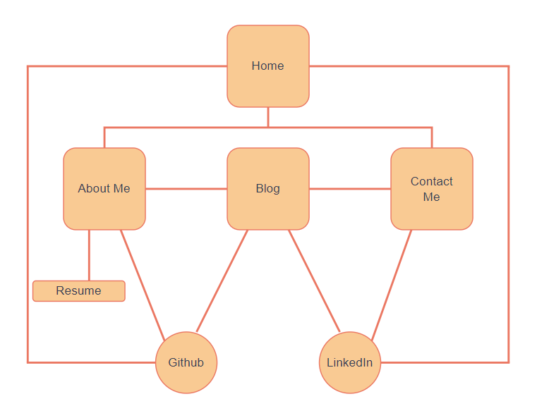
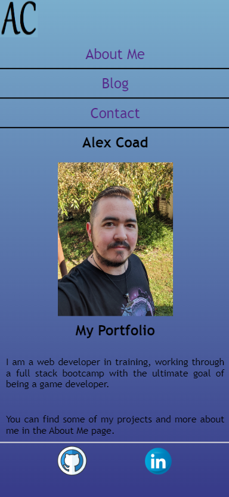
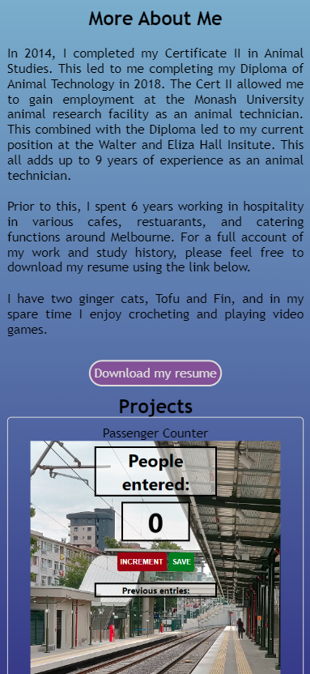
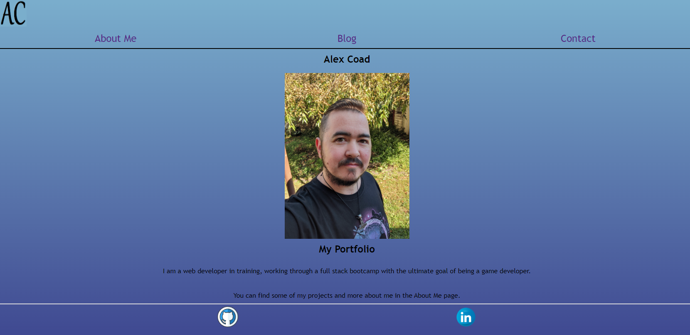

# Alex Coad's Portfolio

## __Purpose__
To showcase my coding capabilities and get to know a little about me.

## __Target Audience__
This portfolio in intended for potential employers looking for a dev and/or IT professional.

## __Functionality and Features__
This site features some of my projects I have previously worked on following tutorials. It also shows some of my general interests and hobbies. My resume is also available for download from the About Me page.

It has been designed to work with desktop browsers as well as mobile devices.

I have also included a form in order to contact me via email.

To access the site and all its code, feel free to use the Github link below.

## __Sitemap__

## __Screenshots__
Here we can see a couple of screenshots of the website as viewed on a mobile device and desktop browser.  
  

## __Where to find me__
I can be found on [Github](https://github.com/forkets/Portfolio) and [LinkedIn](https://www.linkedin.com/in/alex-coad-60a3b5251/)

## __Tech Stack__
 
 

## Links
[Portfolio Site](https://alexcoad.netlify.app/index.html)  
[Presentation Video](https://youtu.be/CuBxuh52EkI)

## Image Credits
I've listed some credits for images used on the Blog page. The cat is my own.

Image by <a href="https://pixabay.com/users/ritae-19628/?utm_source=link-attribution&utm_medium=referral&utm_campaign=image&utm_content=746005">-Rita-👩‍🍳 und 📷 mit ❤</a> from <a href="https://pixabay.com//?utm_source=link-attribution&utm_medium=referral&utm_campaign=image&utm_content=746005">Pixabay</a>

Image by <a href="https://pixabay.com/users/cromaconceptovisual-4595909/?utm_source=link-attribution&utm_medium=referral&utm_campaign=image&utm_content=6022003">cromaconceptovisual</a> from <a href="https://pixabay.com//?utm_source=link-attribution&utm_medium=referral&utm_campaign=image&utm_content=6022003">Pixabay</a>

Image by <a href="https://pixabay.com/users/fancycrave1-1115284/?utm_source=link-attribution&utm_medium=referral&utm_campaign=image&utm_content=820275">fancycrave1</a> from <a href="https://pixabay.com//?utm_source=link-attribution&utm_medium=referral&utm_campaign=image&utm_content=820275">Pixabay</a>

Image by <a href="https://pixabay.com/users/dbreen-1643989/?utm_source=link-attribution&utm_medium=referral&utm_campaign=image&utm_content=1085072">Devon Breen</a> from <a href="https://pixabay.com//?utm_source=link-attribution&utm_medium=referral&utm_campaign=image&utm_content=1085072">Pixabay</a>